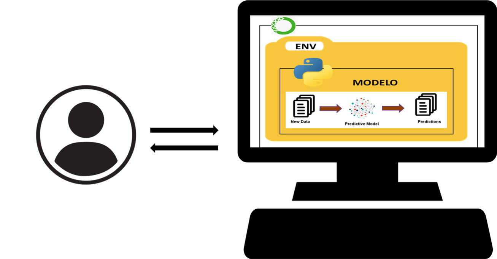

# Despliegue de modelos

## Infraestructura

- **Nombre del modelo:** Modelo Predictor Numeros Loteria
- **Plataforma de despliegue:** 
     El modelo se desplegará localmente en un entorno de Python. Esta configuración permite una integración fácil y directa con aplicaciones y scripts locales de Python, sin la necesidad de configuraciones complejas de servidor o infraestructura en la nube.

- **Requisitos técnicos:** 
    + Python 3.6 o superior.
    + Bibliotecas: 
        * pandas == 2.1.1
        * numpy == 1.26.0
        * scikit-learn == 1.3.0
        * matplotlib == 3.8.2 
        * scipy  ==  0.13.0 

    + Hardware: Depende de la escala del despliegue; para pruebas locales, una computadora estándar es suficiente.

- **Requisitos de seguridad:**  Dado que el modelo se desplegará y utilizará localmente, no hay requisitos específicos de seguridad, como autenticación o encriptación de datos.

- **Diagrama de arquitectura:** 

## Código de despliegue

- **Archivo principal:** `predictor_numeros_loteria.py` Este archivo contiene el código necesario para cargar el modelo entrenado y realizar predicciones basadas en las fechas proporcionadas.
- **Rutas de acceso a los archivos:** 

1. Modelo Entrenado: `tdsp_template\modelo_numeros_loteria.joblib`
ruta donde se encuentra guardado el modelo entrenado que se carga en `predictor_numeros_loteria.py`.
2. Archivo de Datos : https://docs.google.com/spreadsheets/d/e/2PACX-1vSSFEzwj9erdFwLIxBSLhvBTffcJHX8xpmaebnwqWYkij3DywsUOTZmFvs4QZgOazMi--z9JCFLS_Qt/pub?output=csv
- **Variables de entorno:** Para el despligue del modelo de forma Local no es necesario configurar variables de entorno.

## Documentación del despliegue

- **Instrucciones de instalación:** 

1. Instalar Python: Asegúrate de tener Python 3.6 o superior instalado en tu máquina.

2. Instalar Bibliotecas Necesarias

3. Descargar el Código y el Modelo: predictor_numeros_loteria.py y el modelo guardado (archivo .joblib) en una carpeta de tu elección en tu máquina local. Direccion del repositorio: https://github.com/cdparedesb/tdsp_template 

- **Instrucciones de configuración:** 
    + Como el despligue se realiza de manera local lo unico que se debera configurar son las rutas de los Archivos, Asegúrate de que las rutas en predictor_numeros_loteria.py y del  modelo guardado correspondan a las ubicaciones de los archivos en tu máquina.

- **Instrucciones de uso:** 

    1. Ejecutar el Modelo: Abre una terminal, navega a la carpeta donde se encuentra predictor_numeros_loteria.py y ejecuta el script con Python:

            `python predictor_numeros_loteria.py`

    2. Realizar Predicciones: Modifica el archivo predictor_numeros_loteria.py para incluir las fechas para las cuales deseas realizar predicciones y luego ejecuta el script como se describió anteriormente.

- **Instrucciones de mantenimiento:** 

    1. Actualizar Regularmente: Mantén actualizado Python y las bibliotecas instaladas.

    2. Monitoreo del Modelo: Revisa periódicamente el rendimiento del modelo. Si el rendimiento disminuye, considera reentrenar el modelo con datos más recientes.

    3. Reentrenamiento del Modelo: Si es necesario reentrenar el modelo con nuevos datos, sigue el proceso original de entrenamiento y actualiza el archivo .joblib en la ubicación correspondiente.

